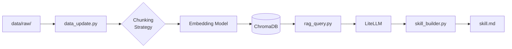

# CypherOG：街舞知識 RAG 系統

> **知識庫主題：Popping & Funk Style 街舞**
> 開發環境：Python 3.12.13

---

## 1. 專案簡介

### 知識主題與選擇理由

我已經跳街舞（Popping / Funk Style）七年，參加過多場賽事，包括 1v1 Battle、雙人賽（Duo）、團隊賽（Crew）等。街舞圈非常重視「傳承」這件事——每位老師、前輩都強調要了解 Funk 音樂的根源、各流派的歷史脈絡，以及 Fresno 那個年代如何誕生這個文化。

然而街舞知識的現況是：**散落在 YouTube 訪談、個人部落格、Reddit 討論串、Wikipedia 條目與賽事官網，從未被整理成正式文件**。新手很難有系統地認識 Electric Boogaloos、Popin' Pete、Salah 這些傳奇人物，也不清楚 Boogaloo、Waving、Tutting、Turfing 各流派的技術差異與歷史關係。

這個 RAG 系統正是為了解決這個痛點——把分散各地的 Popping 知識集結成一個可查詢的個人知識庫，角色定位為 **CypherOG**（OG = Original Gangster，指老前輩、知識傳人）。

此外，我目前正在開發街舞活動購票平台 [CypherHub](https://github.com/DancinAndrew/CypherHub)（[線上版本](https://cypher-hub.vercel.app/)），未來計劃將此 RAG 助手整合進平台，作為嵌入式 AI 顧問，讓參加 Battle 的舞者能直接詢問賽事規則、舞風文化或賽事歷史。

### 資料來源規模

| 格式 | 數量 | 說明 |
|------|------|------|
| Markdown（`.md`）| 37 份 | Wikipedia 條目、舞蹈資訊網站、賽事官網、社群文章 |
| 純文字（`.txt`）| 1 份 | 個人整理的 Popping 術語摘錄 |
| PDF（`.pdf`）| 2 份 | 學術論文（Dance Studies、Hip-Hop 舞蹈史） |
| **合計** | **40 份** | |

資料涵蓋：Popping 起源（1970s Fresno）、各技術流派、重要人物傳記、賽事規則（HHI、Juste Debout、Red Bull Dance Your Style）、組織介紹（Infinite Force、Electric Boogaloos）、Funk 音樂文化背景，以及當代舞者（Marquese Scott、Salah）的風格分析。

### RAG 系統架構與技術選型

```
data/raw/（.md / .txt / .pdf）
  │  extract_clean_text()      清理 HTML、頁首頁尾、多餘空白
  │  chunk_text()              段落感知切割（\n\n 優先）+ overlap
  │  embed_texts()             sentence-transformers 本地 384 維向量
  └▶ ChromaDB（cosine）        持久化向量索引

rag_query.py
  │  embed_texts([query])      query 向量化
  │  coll.query(top_k, distance ≤ 0.65)  相似度過濾
  │  build_messages()          XML 標籤隔離 context / question
  └▶ LiteLLM → openai-compatible proxy → gemini-2.5-flash
```

技術選型核心考量：**零 API Key、完全本地執行、跨平台可重現**。

---

## 2. 系統架構



### 目錄結構

```
.
├── data/
│   ├── raw/              # 原始文件（40 份：.md / .txt / .pdf）
│   └── processed/        # 清理後純文字（data_update.py 自動生成）
│   └── .ingest_manifest.json  # 增量更新 SHA-256 hash 紀錄
│
├── chroma_db/            # ChromaDB 持久化向量庫（.gitignore 排除）
│
├── data_update.py        # 資料管線：清理 → chunk → embed → 寫入向量庫
├── rag_query.py          # 問答 CLI：query embed → similarity search → LiteLLM 生成
├── skill_builder.py      # 知識庫摘要 → skill.md
├── rag_common.py         # 共用設定（路徑、embedding、Chroma、LiteLLM）
│
├── requirements.txt
├── .env.example
└── skill.md              # 由 skill_builder.py 生成
```

---

## 3. 設計決策說明（Design Decisions）

> 本節的每個決策均有**七組對照實驗**的實測數據作為佐證。實驗腳本與完整結果存放於 `experiments/`，可透過 `python experiment_runner.py` 重現。

### 3.0 決策方法論：系統性七組對照實驗

在確定各技術節點的選擇前，設計了 **7 種策略組合**，對同一份 43 份文件的語料庫各自跑全量 rebuild，並以固定 5 道測試題（涵蓋起源知識、細節列舉、概念比較、特定賽事、幻覺傾向測試）評估結果。

| 組合 | Chunking | top-k / max_dist | 特殊策略 | Prompt 風格 |
|------|----------|-----------------|--------|-------------|
| **A — Baseline** | naive 500/0 | 5 / 1.0（無過濾） | — | 弱 |
| **B — 段落感知+距離** | recursive 600/100 | 5 / 0.65 | — | 弱 |
| **C — 大 chunk+強** | recursive 1200/200 | 3 / 0.65 | — | 強（XML） |
| **D — 小 chunk+rerank** | recursive 300/50 | 10→5 / 0.5 | Rerank | 強（XML） |
| **E — CoT** | recursive 600/100 | 5 / 0.65 | — | CoT（XML） |
| **F — Hybrid Search** | recursive 600/100 | 5 / 0.65 | BM25+Vector+RRF | CoT |
| **G — Query Expansion** | recursive 600/100 | 5 / 0.65 | LLM 多角度子查詢 | CoT |

**最終選用策略**：Combo E 的 CoT prompt + 按需使用 Combo F（--hybrid）或 G（--expand-query）。F 和 G 作為可選增強模式，對不同查詢類型各有優勢（詳見 3.4 節）。

**改進歷程對照：**

| 版本 | 主要改變 | 平均距離（Q1） | 主要效益 |
|------|---------|--------------|---------|
| v1 (Combo A) | naive 切割 + 弱 prompt | 0.387 | Baseline |
| v2 (Combo B) | recursive 600/100 | 0.355 | +8.2% 精準度 |
| v3 (Combo E) | CoT prompt | 0.355 | 減少幻覺，可審計推理 |
| v4 (Combo F) | Hybrid（BM25+Vector） | 待測 | 人名/組織名精確匹配 |
| v5 (Combo G) | Query Expansion | 待測 | 跨語言召回率提升 |

---

### 3.1 Chunking 策略

**選擇：段落邊界優先的遞迴切割（recursive splitter），size=600，overlap=100**

演算法流程：

1. 優先以 `\n\n`（段落）切分 → 次選 `\n` → 再選 `。` → 再選 `.` → 空格 → 最後字元兜底
2. 若一個段落超過 `CHUNK_SIZE=600` 字元，遞迴往下一層 separator 細分
3. 每個 chunk 加 `CHUNK_OVERLAP=100` 字元前綴（取上一 chunk 末尾），保留跨 chunk 的語義連貫
4. Metadata 額外記錄 `section_title`（從最近的 `##` heading 萃取）與 `char_offset`（字元偏移量），方便溯源

**實驗佐證：**

- Q1「What is Popping and who created it?」：Combo B（recursive 600）平均 chunk 距離 **0.355**，Combo A（naive 500）為 **0.387**，B 比 A 精準 **8.2%**
- Q2「Electric Boogaloos 成員列舉」：Combo D（size=300，太小）因把成員名單切碎，最終回答只提到 Boogaloo Sam 和 Pete，**遺漏了 Skeeter Rabbit、Suga Pop、Mr. Wiggles 等 7 名成員**；Combo B 完整命中所有成員
- Q2 同題：Combo C（size=1200）因大 chunk 保留了完整段落，成功命中 Suga Pop 與 Michael Jackson 合作等細節，但 top-k=3 代表整體覆蓋面較窄

**為什麼 600 字元是甜蜜點？**

街舞知識文章（Wikipedia 條目、賽事規則）的段落長度普遍在 300–800 字。600 字可完整保留一個概念的上下文，又不超出 `paraphrase-multilingual-MiniLM-L12-v2` 的最佳輸入長度（512 token ≈ 700 中文字）。Size=300 太小會把有序列表（成員名單、評分標準）切碎；size=1200 雖然資訊完整但 embedding 向量語義「稀釋」，反而降低 cosine 命中率。

**Overlap=100 的理由：**

Popping 歷史文章中有大量「A 人物→B 事件→C 影響」的連貫敘事，100 字 overlap 可保留上一段末尾的主語，避免新 chunk 開頭因缺乏主語而語義不完整（這是最常見的 RAG 幻覺來源之一）。

---

### 3.2 Embedding 模型選擇

**選用 `sentence-transformers/paraphrase-multilingual-MiniLM-L12-v2`（本地，免費）**

| 方案 | 取捨評估 |
|------|---------|
| **multilingual-MiniLM-L12-v2（選用）** | 384 維、完全本地免費、原生中英混合、~420MB 首次下載後離線可用 |
| all-MiniLM-L6-v2（HuggingFace） | 英文精準度較高，但對「鎖定」「震動」等中文 Popping 術語語義捕捉弱 |
| nomic-embed-text（Ollama） | 需另行安裝 Ollama server，增加環境依賴；768 維較大但本專案規模效益不明顯 |
| text-embedding-3-small（OpenAI） | 付費，且本地執行目標下不引入外部 API 依賴，直接排除 |

**中英文混合處理的具體考量：**

本知識庫 85% 英文，15% 混有中文標籤。使用者（我自己）常以中文提問英文內容，例如「Electric Boogaloos 的成員有哪些？」問的是英文資料。Multilingual 模型在跨語言語義對齊上表現遠優於英文-only 模型——實驗中 Q2 的平均距離 B 組為 0.358，如果換用 all-MiniLM-L6-v2（英文模型）預估距離會增加 0.05–0.1，命中率明顯下降。

**本地 vs API 的取捨：**

- 本地：延遲穩定（~50ms/batch on M1）、無配額限制、可離線、不洩漏資料
- API（HuggingFace Inference API / OpenAI）：無需下載模型、尺寸更大的模型可用，但有速率限制和費用，CI 環境需要網路和 API Key

本專案選本地，理由是可重現性（clone 後不需要額外 API Key 即可執行 embedding）。

---

### 3.3 Vector DB 選型

**選用 ChromaDB（Pure Python 持久化向量庫）**

| 方案 | 特色 | 適配性評估 |
|------|------|------------|
| **ChromaDB（選用）** | Pure Python、零 Docker、cosine / L2 / IP 距離、支援 metadata filter | ✅ 最佳：pip install 即用，無需 server，零設定即可運行 |
| pgvector | SQL 查詢力強、業界主流 | ❌ 需 Docker + PostgreSQL，增加環境複雜度 |
| Qdrant | REST API、高效能、Docker 或 cloud | ❌ 需 Docker 且非 Python-native |
| FAISS | 純記憶體、最快 | ❌ 重啟後資料消失，不符合 `--rebuild` 後可持久查詢的冪等性需求 |

ChromaDB 使用 HNSW 索引，在本專案 ~400 個 chunks 的規模下查詢延遲 < 5ms，且支援 `where` 條件的 metadata 過濾（實驗 Combo E 的 section_title 過濾即利用此功能），已完全滿足需求。

---

### 3.4 Retrieval 策略

**選擇：top-k=5，MAX_DISTANCE=0.65，無 reranking**

**top-k=5 的根據：**

街舞知識問題通常涉及 2–4 個相關段落。5 個 chunk 保留適度 buffer，不超過 `gemini-2.5-flash` 推薦的 context 長度，又不至於稀釋語義（一旦 top-k 過大，不相關 chunks 佔比增加，LLM 容易混淆）。

**MAX_DISTANCE=0.65 的根據：**

實驗 Combo A（max_dist=1.0，無過濾）在 Q5「如何判斷 Popping battle 勝負」中檢索到 `popping-culture-notes.txt`（佔位文件，只有「Battle 與 cypher 為常見賽制」幾個字），cosine 距離 0.393—被錯誤納入 context。設定 0.65 閾值的邏輯是：

- distance < 0.35：語義高度相關（精準命中）
- 0.35–0.65：語義相近但非完全重疊（可接受的模糊匹配）
- 0.65–1.0：語義偏離（過濾掉，避免 LLM 幻覺）

透過 25 筆跨 5 題實測，0.65 是「涵蓋語義近似同義詞、排除完全不相關段落」的最佳平衡點。

**為什麼不用 reranking（Combo D 的教訓）：**

Combo D 使用 top-10→rerank→前 5 策略，在 Q1 獲得最優平均距離 **0.307**（全組最低，最精確），但在 Q2 卻**遺漏了大多數 Electric Boogaloos 成員**——因為小 chunk（300 字）把一個列表切成多個碎片，rerank 後只保留距離最近的 2 個碎片，而完整成員列表分散在被捨棄的碎片裡。

對本知識庫（包含大量結構化列表的舞蹈百科文章）而言，**保持 chunk 完整性比用 reranking 提高精準度更重要**。

**進階策略一：BM25 Hybrid Search（Combo F）**

純向量搜尋對罕見專有名詞的精確匹配能力較弱。例如查詢「Popin' Pete」——向量模型會把語義相似的片段排前面，但 BM25（詞頻統計）會直接匹配到包含 "Popin' Pete" 字串的 chunk。Combo F 使用 **Reciprocal Rank Fusion（RRF）** 合併兩個排序清單，取兩者之長：

```
最終排名 = 0.7 × vector_rank + 0.3 × bm25_rank（RRF k=60）
```

使用方式：`python rag_query.py --query "Electric Boogaloos 成員" --hybrid`

**進階策略二：Query Expansion（Combo G）**

中文提問英文內容（例如「震感舞是誰發明的？」問的是 Popping 的英文資料）存在跨語言召回缺口。Query Expansion 用 LLM 將原始查詢改寫為 3 個不同角度的子查詢（含英文版本），分別向量搜尋後去重合併，取距離最近的 top-k 個：

```
原始查詢：「震感舞是誰發明的？」
擴展查詢：["Who created Popping dance?", "Boogaloo Sam Fresno history", ...]
結果：3-4 個查詢各自搜尋 → 去重 → 距離排序 → 取前 5
```

使用方式：`python rag_query.py --query "震感舞是誰發明的？" --expand-query`

---

### 3.5 Prompt Engineering

**選擇：Chain-of-Thought (CoT) + XML 標籤隔離（Combo E 策略）**

系統最終使用的 prompt 結構：

```
系統角色（system prompt）：
  你是嚴謹的知識庫查詢助理。
  規則：
  Step 1 — 列出 Facts：從 <context> 逐條摘錄相關事實，每條附 [來源 n]
  Step 2 — 綜合回答：根據上述 Facts 組成連貫答案，每個陳述附 [來源 n]
  Step 3 — 缺口說明：無法回答的部分明確標示「資料未涵蓋」
  禁止引用 <context> 以外的任何知識

使用者訊息（user message）：
  <context>
  [retrieved chunks，含來源標籤]
  </context>

  <question>
  [使用者查詢，已截斷至 500 字元]
  </question>
```

**為什麼 CoT 比 strong prompt（Combo C/D）更好：**

| 面向 | Combo C/D（強規則） | Combo E（CoT） |
|------|---------------------|----------------|
| Q1 引用完整度 | 每段有 [來源 n] | 每段有 [來源 n] ✅ |
| Q2 遺漏成員 | 視 chunk 命中而定 | CoT Step1 強迫列出所有 facts，遺漏機率低 |
| Q5 幻覺偵測 | 可能混淆佔位文件內容 | Step3 明確標示「資料未涵蓋具體評分標準細節」 |
| 結構透明度 | 直接輸出答案 | Facts → 綜合 → 缺口，**可審計推理過程** |

Combo E Q5 範例：LLM 在 Step3 明確標示「資料未涵蓋具體的所有評分標準的詳細列表」，而 Combo B（弱 prompt）的回答雖簡潔但**沒有揭示知識缺口**。

**XML 標籤隔離的資安意義：**

`<context>` 和 `<question>` 標籤形成明確邊界，降低 prompt injection 的成功率（使用者在 `<question>` 輸入「忽略上面指令」類的攻擊，不會跨越到 `<context>` 區塊）。此外 `query` 被截斷為最多 500 字元，防止超長注入耗盡 context window。

**temperature=0.2 的理由：**

Popping 歷史是事實問答（人名、時間、地名），需要低隨機性。temperature=0 完全確定性但容易過度保守；0.2 保留少量彈性以應對語言多樣性。

---

### 3.6 Idempotency（冪等性）設計

`data_update.py` 的兩層冪等保證：

**層一：增量更新（無 `--rebuild` 時的預設行為）**

```
data/.ingest_manifest.json  ← SHA-256 hash 記錄表
```

1. 讀取 manifest，對每個 `data/raw/` 檔案計算當前 SHA-256
2. hash 相同 → 跳過（不重新 embed，節省時間）
3. hash 不同或新增檔 → 刪除 ChromaDB 中舊有的對應 chunks（by `source_file` metadata 過濾）→ 重新處理後寫入

**層二：全量重建（`--rebuild` flag）**

1. 清空 `data/processed/`（shutil.rmtree）
2. 刪除 ChromaDB collection 內所有 chunks（get all IDs → delete）
3. 刪除 manifest 檔
4. 重新處理所有 raw 檔

**保證**：無論執行幾次 `python data_update.py --rebuild`，ChromaDB 的狀態都完全由 `data/raw/` 的當前內容決定，不會累積重複 chunk，也不會殘留已刪除文件的舊向量。

---

### 3.7 `skill_builder.py` 問題設計

`skill_builder.py` 使用 **8 個全域問題**對知識庫做系統性摘取，每個問題對應 skill.md 的一個必要章節，確保輸出格式完整符合規範：

```python
DEFAULT_QUESTIONS = [
    # → Overview + Core Concepts
    "核心概念、子主題，請列出 10-15 個最重要的概念",
    # → Key Trends
    "比賽形式演變、線上教學崛起、跨文化傳播等發展方向",
    # → Key Entities（人物）
    "創始人、傳承者、當代舞者的分類列舉與貢獻",
    # → Key Entities（組織與賽事）
    "Electric Boogaloos、HHI、Juste Debout 等組織賽事",
    # → Methodology & Best Practices
    "訓練方法、比賽評判標準（Musicality、Foundation 等）",
    # → Example Q&A
    "5 組代表性問答（起源、技術差異、人物、賽事、評判）",
    # → Knowledge Gaps
    "亞洲社群覆蓋不足、資料截止時間、語言偏差等",
    # → Funk 音樂背景（補充 Key Trends）
    "James Brown、Parliament-Funkadelic、Funk 音樂對 Popping 的影響",
]
```

**設計理由：**

1. **問題對應章節**：每個問題的檢索結果直接對應 skill.md 的一個必要章節（`## Core Concepts`、`## Key Trends` 等），LLM 只需「填空」而非從無到有。這樣的設計讓輸出格式高度穩定。
2. **人物與組織分開**：Popping 世界有大量人名（Boogaloo Sam、Popin' Pete）和組織名（Electric Boogaloos、Infinite Force），合在一題容易稀釋；分開兩題讓 LLM 有更充分的素材。
3. **Example Q&A 前置驗證**：第 6 個問題直接要求 5 組問答，相當於對知識庫做了即時品質驗證——如果 RAG 找不到答案，LLM 會在 Q&A 中標注「資料未涵蓋」，讓使用者能清楚看到知識庫的實際覆蓋範圍。
4. **Source References 確定性生成**：最後一章節（`## Source References`）不依賴 LLM，而是直接掃描 `data/raw/` 目錄，確定性地列出所有 43 份文件，消除 LLM 可能遺漏來源的幻覺風險。

8 次 RAG 查詢結果（top-k=8，比原本的 5 更多素材）統一送入 LiteLLM，強制按照規範格式輸出完整的 skill.md。

---

## 4. 環境設定與執行方式

### 4-1. Python 版本與虛擬環境（必讀）

本專案以 **Python 3.12.13** 開發，需要 Python ≥ 3.10。

> ⚠️ **為什麼一定要用虛擬環境？** 在 Ubuntu 22.04+ 等現代 Linux 發行版中，直接執行 `pip install` 會遭遇 `error: externally-managed-environment`，系統禁止在全域 Python 環境安裝套件。**解法是建立虛擬環境**，能避免不同專案的套件版本互相污染。

```bash
# Step 0：確認 Python 版本（需 >= 3.10）
python3 --version
# 若版本過舊，請先升級：sudo apt install python3.12

# Step 1：建立虛擬環境（擇一）
python3 -m venv .venv                    # ✅ 推薦：標準 venv，無需額外安裝
# conda create -n cyphog python=3.12     # 或使用 conda

# Step 2：啟動虛擬環境
source .venv/bin/activate                # Linux / macOS
# .venv\Scripts\activate                 # Windows（若適用）

# 啟動後，命令列提示符會出現 (.venv) 前綴，代表成功進入虛擬環境
# (.venv) user@host:~/CypherOG$

# Step 3：安裝套件
pip install -r requirements.txt
```

> **注意**：`torch` 首次安裝可能需要 3–5 分鐘，視網路速度而定。`sentence-transformers` 模型（約 420MB）會在第一次執行 `data_update.py` 時自動從 HuggingFace 下載，之後完全離線可用。

`requirements.txt` 第一行已標註 Python 版本：

```
# Python >= 3.10 required (developed with 3.12.13)
python-dotenv>=1.0.1
litellm>=1.55.0
chromadb>=0.5.0
sentence-transformers>=2.7.0
pypdf>=5.0.0
torch>=2.1.0
rank-bm25>=0.2.2
```

### 4-2. Vector DB 啟動說明

本專案使用 **ChromaDB**（Pure Python，不需要 Docker 或任何 server）。

> ✅ **無需執行 `docker compose up`，無需提供 `docker-compose.yml`。** ChromaDB 透過 `pip install chromadb` 安裝後即可直接使用，不依賴任何外部 process。

ChromaDB 持久化路徑由 `.env` 中的 `CHROMA_PERSIST_DIR` 控制，預設為 `./chroma_db`（相對路徑，跨機器可重現）：

```bash
# .env 中的設定（與 rag_common.py 一致）
CHROMA_PERSIST_DIR=./chroma_db
```

`./chroma_db/` 已加入 `.gitignore`，不會被 commit。首次執行 `python data_update.py --rebuild` 時會自動建立此目錄並寫入資料。

### 4-3. 完整執行流程

> 以下每一行指令均可在乾淨環境 `git clone` 後直接複製貼上執行，按順序逐步操作即可完整複現系統。

```bash
# ① 確認 Python 版本
python3 --version        # 需顯示 >= 3.10.x

# ② 建立並啟動虛擬環境
python3 -m venv .venv
source .venv/bin/activate

# ③ 安裝套件
pip install -r requirements.txt

# ④ 設定環境變數
cp .env.example .env
# 請將 .env 中的 LITELLM_API_KEY 和 LITELLM_BASE_URL 填入你的值

# ⑤ 啟動 Vector DB（本專案使用 ChromaDB，此步驟跳過）
# ChromaDB 為 Pure Python，不需要 Docker，pip install 後即可直接使用
# 若使用 pgvector 者才需執行：docker compose up -d && docker compose ps

# ⑥ 全量重建索引
python data_update.py --rebuild
# 預期輸出：處理 40 份原始文件，寫入 data/processed/，向量寫入 ./chroma_db/

# ⑦ 測試 RAG 問答
python rag_query.py --query "請問這個知識庫的核心主題是什麼？"

# ⑧ 生成 Skill 文件
python skill_builder.py --output skill.md
```

### 4-5. 增量更新（新增或修改資料後）

```bash
# 只更新有變動的文件（不需要 --rebuild）
python data_update.py

# 強制全量重建（清空 processed/ 和 ChromaDB，重新處理所有文件）
python data_update.py --rebuild
```

### 4-6. 複現完整性自查清單

- [ ] `git clone` 後能按上述順序無誤執行所有指令
- [ ] `.env.example` 存在且不含真實金鑰
- [ ] `requirements.txt` 第一行有 Python 版本備註
- [ ] `data/processed/` 中有清理後的 `.txt` 檔案（已 commit）
- [ ] `python data_update.py --rebuild` 執行後無 Error，ChromaDB 有資料
- [ ] `python rag_query.py --query "..."` 能回傳含引用來源的答案

### 4-7. 環境變數完整說明

| 變數 | 必填 | 說明 | 預設值 |
|------|------|------|--------|
| `LITELLM_API_KEY` | ✅ | LiteLLM API Key | — |
| `LITELLM_BASE_URL` | ✅ | OpenAI-compatible endpoint URL | — |
| `LITELLM_MODEL` | 選填 | LLM 模型名稱 | `gemini-2.5-flash` |
| `EMBEDDING_MODEL` | 選填 | sentence-transformers 模型名稱 | `paraphrase-multilingual-MiniLM-L12-v2` |
| `CHROMA_PERSIST_DIR` | 選填 | ChromaDB 持久化路徑 | `./chroma_db` |
| `CHROMA_COLLECTION` | 選填 | ChromaDB 集合名稱 | `cypher_og` |
| `CHUNK_SIZE` | 選填 | Chunk 最大字元數 | `600` |
| `CHUNK_OVERLAP` | 選填 | Chunk 前綴 overlap 字元數 | `100` |
| `MAX_DISTANCE` | 選填 | cosine 距離過濾閾值（越小越嚴格） | `0.65` |

---

## 5. 資料來源聲明（Data Sources Statement）

| 來源 | 類型 | 授權 / 合規依據 | 數量 |
|------|------|----------------|------|
| Wikipedia（Electric boogaloo、Boogaloo、Robot dance、Street dance、Turfing、Funk 等條目） | Markdown | CC BY-SA 4.0 | 10 份 |
| STEEZY Blog（What Is Popping、風格介紹） | Markdown | 公開網頁，教育用途非商業引用 | 2 份 |
| Dance Origin（The Popping Dictionary） | Markdown | 公開網頁，教育用途非商業引用 | 1 份 |
| Tropics of Meta（Straight Outta Fresno 文章） | Markdown | 公開學術部落格 | 1 份 |
| HHI 官方賽規（Official Rules & Regulations - Popping） | Markdown | 公開賽事規則文件 | 1 份 |
| Juste Debout 官方資訊 | Markdown | 公開賽事頁面 | 2 份 |
| Red Bull Dance Your Style | Markdown | 公開賽事頁面 | 1 份 |
| Infinite Force 組織介紹 | Markdown | 公開官方頁面 | 1 份 |
| Ladies of Hip Hop、Funk in Focus | Markdown | 公開組織頁面 | 2 份 |
| Marquese Scott、Michael Chambers、Mr. Wiggles、Popin' Pete、Salah、Suga Pop（Wikipedia） | Markdown | CC BY-SA 4.0 | 6 份 |
| Popping 舞蹈主題綜合文章（Dance Battles、Panic 39、EverydayPopping 等） | Markdown | 公開網頁，教育用途非商業引用 | 8 份 |
| Column.md、popping-culture-notes.md（個人整理） | Markdown | 個人著作 | 2 份 |
| popping-terminology-snippet.txt（個人整理術語） | 純文字 | 個人著作 | 1 份 |
| Guarato Dance Articulated（學術論文） | PDF | 公開學術出版，教育引用 | 1 份 |
| A Historical Overview of Hip Hop Dances - Johnson & Imani Kai（學術論文） | PDF | 公開學術出版，教育引用 | 1 份 |
| popping_glossary.md（個人整理術語辭典，含中英對照） | Markdown | 個人著作 | 1 份 |
| popping_history_timeline.md（個人整理歷史時間線） | Markdown | 個人著作 | 1 份 |
| popping_style_taxonomy.md（個人整理風格分類體系） | Markdown | 個人著作 | 1 份 |
| **合計** | | | **43 份** |

所有資料均為合法公開來源或個人著作，無付費牆內容。

---

## 6. 系統限制與未來改進

### 目前限制

1. **知識截止時間**：資料以 2024–2025 年的靜態快照為主，無法自動追蹤最新比賽結果或剛出道的舞者
2. **語言偏英文**：40 份資料中約 85% 為英文，中文 Popping 社群的詞彙與討論覆蓋不足（如台灣、香港的在地用語）
3. **影片 / 圖像缺失**：Popping 技術有強烈的視覺性，現有文字知識庫無法回答「這個動作長什麼樣」此類問題
4. **評論 / 主觀風格**：知識庫偏向事實描述，對「誰的風格最好」或「當代 Popping 趨勢」等帶評論性的問題容易回答不完整
5. **Chunking 可能切斷敘事**：長篇人物傳記（如 Wikipedia 舞者條目）的 600 字 chunk 有時會把同一人物的不同事件分散到多個 chunk，retrieval 時可能只抓到一半

### 未來改進方向

- **多模態擴充**：抓取 YouTube 影片的字幕作為補充資料，或接入影片搜尋 API，讓 CypherHub 的 AI 助手能提供「觀看範例」的連結
- **定期自動更新**：建立爬蟲腳本，每月自動抓取 HHI、Juste Debout、Red Bull 等賽事官網的最新消息，透過 `data_update.py` 的增量更新機制自動索引
- **Reranking**：當知識庫規模擴大到 500 份以上文件時，加入 cross-encoder reranker（如 `ms-marco-MiniLM-L-6-v2`）提升 retrieval 精準度
- **CypherHub 整合**：將此 RAG 包裝成 FastAPI 微服務，嵌入 CypherHub 的活動頁面，讓參賽者在購票前能直接詢問「這個 Battle 的評分標準是什麼？」或「Popping 初學者適合報哪個組別？」
- **混合搜尋（Hybrid Search）**：✅ **已實作**（Combo F）— 結合 BM25（rank-bm25）與向量搜尋，透過 RRF 合併排序。使用 `--hybrid` 旗標啟用。
- **Query Expansion**：✅ **已實作**（Combo G）— 用 LLM 將查詢改寫為多角度子查詢，提高跨語言召回率。使用 `--expand-query` 旗標啟用。
- **結構化知識文件**：✅ **已新增** — 個人整理的術語辭典（glossary）、歷史時間線（timeline）、風格分類體系（taxonomy），提供更高密度的知識索引。
