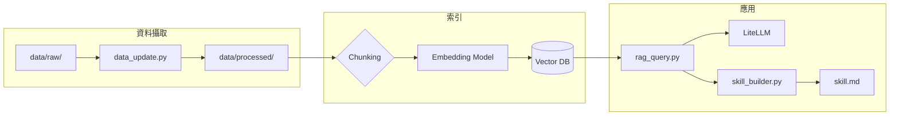

# CypherOG — Popping 起源、風格流變與現代賽事文化 RAG

> **AIASE2026 HW3｜個人知識 RAG**：從原始資料到 `skill.md` 的輕量檢索增強生成管線。

---

## 1. 專案簡介

### 1.1 知識主題與選題理由

本專案主題為 **「Popping 的起源與核心風格流變以及現代賽事文化庫」**。

- **起源與脈絡**：Popping 與 West Coast funk、Boogaloo、Electric Boogaloos 等脈絡密不可分；釐清「何為 popping」「與 locking、animation 等風格的邊界」需要可追溯的文字與訪談脈絡，適合用 RAG 做**有出處的問答**。
- **風格流變**：從經典 boogaloo、animation、waving、strutting 到當代在 battle 中的詮釋差異，語料時間跨度長、術語多，適合以 **chunk + 向量檢索** 支援細部查詢。
- **現代賽事文化**：賽制（預選、淘汰、cypher、邀請制）、裁判焦點與社群敘事常散見於訪談、報導與紀錄文字；整合為知識庫後，可回答「賽事類型差異」「常見評判維度」等**情境型問題**。

### 1.2 資料來源類型與規模（規劃）

| 面向 | 說明 |
|------|------|
| **格式** | 至少涵蓋 `.md`、`.txt`；若有合法授權之 PDF（例如公開演講稿、CC 授權文章），一併納入 `data/raw/`。 |
| **規模** | 作業要求 **chunk 前至少 20 份文件／片段**；本庫以「歷史與風格條目、人物與團體介紹、賽事與文化評論、個人整理筆記」組合達標。 |
| **時間範圍** | 1970 年代 funk／boogaloo 脈絡至當代賽事與社群論述（於各文件 metadata 或檔名中標註年份／版本）。 |

### 1.3 RAG 架構與技術選型（摘要）

- **管線**：`data/raw/` → `data_update.py`（清理 → `data/processed/` → chunk → embedding）→ **Vector DB** → `rag_query.py`（retrieve + LiteLLM 生成，附引用）→ `skill_builder.py` → `skill.md`。
- **LLM**：**LiteLLM** 統一介面，預設 `gemini-2.5-flash`（與作業規範一致，可透過 CLI 切換）。
- **Embedding**：建議 **sentence-transformers** 本地模型 `paraphrase-multilingual-MiniLM-L12-v2`（中英混合與台灣常用中文語料較友善，且無需額外 API 費用）。

---

## 2. 系統架構說明



**資料流說明**：原始檔於 `data_update.py` 內清理後寫入 `data/processed/`（與向量化解耦）；chunk 經 embedding 寫入向量庫；`rag_query.py` 對使用者查詢做相似度檢索並組 prompt，經 LiteLLM 取得回答；`skill_builder.py` 以多輪「全域問題」檢索並彙整為 `skill.md`。

---

## 3. 設計決策說明（Design Decisions）

### 3.1 Chunking 策略

- **策略**：以**固定字元長度**（例如 500–800 字）搭配 **overlap**（例如 80–120 字），避免在單一句點切斷造成語意斷裂；若段落明顯（雙換行），優先在段落邊界附近對齊切分。
- **理由**：Popping 相關文本常混雜術語表、人名與年代，過長 chunk 會稀釋向量語意，過短則失去脈絡；overlap 可減少「裁判標準」「賽制」等跨句資訊被切斷的機率。

### 3.2 Embedding 模型

- **選擇**：`paraphrase-multilingual-MiniLM-L12-v2`（**sentence-transformers**，本地推論）。
- **理由**：資料含**英文專有名詞與中文解說**時，多語模型較能對齊查詢與段落；無需 HuggingFace Inference 額度或 Ollama 額外程序，利於助教複現。
- **取捨**：本地模型首次需下載權重（約百 MB 級）；換得穩定、免費、可離線重跑索引。

### 3.3 Vector DB 選型

- **選項 A（建議新手）**：**ChromaDB** — 純 Python、不需另起資料庫容器，`CHROMA_PERSIST_DIR` 指向專案內持久化目錄；**請將向量庫目錄列入 `.gitignore`**，避免二進位或大型索引上傳。
- **選項 B**：**pgvector** — 需 `docker-compose.yml` 啟動 PostgreSQL，利於 SQL 與 metadata 過濾；若本專案採用此方案，README 中「④ Vector DB」步驟需執行 `docker compose up -d`。

（請於實作定案後，刪去未使用之選項描述，避免混淆。）

### 3.4 Retrieval 策略

- **top-k**：預設 **5**（CLI 可 `--top-k` 調整）；名詞解釋類問題可視需要調高，以免漏掉不同年代的用法差異。
- **Reranking / metadata**：第一版以向量相似度為主；若資料量增大，可對「年代」「文件類型（史論／賽評／訪談）」做 metadata 過濾後再檢索。

### 3.5 Prompt Engineering

- **系統提示**：明確要求模型**只根據检索到的段落**回答，並在無法從脈絡推論時表明不確定性。
- **使用者提示**：注入 top-k chunks，並要求**逐條標註來源**（檔名 + chunk／段落編號），與作業「引用來源顯示」一致。

### 3.6 Idempotency（`data_update.py`）

- **`--rebuild`**：清空 `data/processed/`（或依作業規範之重建範圍）並重建向量索引，使 DB 狀態與目前 `data/raw/` 一致，避免重複累積。
- **增量更新（建議）**：以檔案 **hash 或 mtime** 判斷變更，僅重新清理、chunk、寫入變更檔對應之向量；未變更檔不重複 embedding。

### 3.7 `skill_builder.py` 全域問題設計

針對本主題，預設掃描型問題包含（可實作為腳本內常數）：

1. Popping 在歷史上與哪些音樂／文化運動相關？主要人物或團體有哪些？
2. 「風格」維度上，boogaloo、animation、waving 等如何區分與融合？
3. 現代賽事中常見的賽制與評判語彙為何？與早期舞廳／社群脈絡有何差異？
4. 本知識庫涵蓋哪些資料類型與缺口（例如缺影像、僅文字）？

---

## 4. 環境設定與執行方式

### 4-1. Python 版本與虛擬環境

**開發環境 Python 版本：`3.11.9`（請依你本機實際版本修改；需 ≥ 3.10）。**

```bash
python3 --version
python3 -m venv .venv
source .venv/bin/activate
pip install -r requirements.txt
```

- **Windows**：`\.venv\Scripts\activate`

### 4-2. Vector DB

- **若使用 ChromaDB**：無需 Docker；於 `.env` 設定 `CHROMA_PERSIST_DIR`（例如 `./chroma_db`），並確保該路徑已列於 `.gitignore`。
- **若使用 pgvector**：專案根目錄需有 `docker-compose.yml`（volume 使用**相對路徑**），例如：

```bash
docker compose up -d
docker compose ps
```

### 4-3. 環境變數

```bash
cp .env.example .env
```

將 `LITELLM_API_KEY`、`LITELLM_BASE_URL` 填入助教提供之值；Embedding 與 Vector DB 變數依 `.env.example` 註解擇一填寫。

### 4-4. 完整執行流程（複現用）

```bash
# ① 確認 Python 版本
python3 --version

# ② 建立並啟動虛擬環境
python3 -m venv .venv
source .venv/bin/activate

# ③ 安裝套件
pip install -r requirements.txt

# ④ 設定環境變數
cp .env.example .env

# ⑤ 啟動 Vector DB（僅 pgvector / Qdrant 等需要時；ChromaDB 略過）
docker compose up -d
docker compose ps

# ⑥ 全量重建索引
python data_update.py --rebuild

# ⑦ 測試 RAG 問答
python rag_query.py --query "Popping 與 Boogaloo 的歷史關聯為何？請依資料說明。"

# ⑧ 生成 Skill 文件
python skill_builder.py --output skill.md
```

### 4-5. 互動式與單次查詢

```bash
python rag_query.py
python rag_query.py --query "現代 popping battle 常見的評判面向有哪些？" --top-k 5 --model gemini-2.5-flash
```

---

## 5. 資料來源聲明（Data Sources Statement）

> 以下為**範例結構**；請於繳交前依 `data/raw/` 實際檔案更新表格內容與數量。

| 來源名稱 | 類型 | 授權／合規依據 | 數量（約） |
|----------|------|----------------|------------|
| 維基百科／Wikimedia 相關條目（英文為主） | Markdown／文字 | CC BY-SA（需註明來源與相同方式分享衍生作品） | 若干 |
| 公開訪談、演講逐字稿（主辦或講者公開釋出） | `.txt`／`.md` | 依各來源授權／使用條款 | 若干 |
| 個人整理之舞風與賽事筆記 | Markdown | 個人著作 | 若干 |
| 合法取得之 PDF（期刊開放取得、CC 論文等） | PDF | 依各文件授權 | 若干 |

**合規提醒**：勿爬取付費牆內容；引用社群長文時注意原作者是否禁止轉載；純事實與短語句不受著作權保護，但**完整文章**仍應取得授權或使用開放授權來源。

---

## 6. 系統限制與未來改進

| 限制 | 說明 |
|------|------|
| **媒體型知識** | 本庫以文字為主，**無法**直接回答「某場決勝 round 的影像細節」；未來可連結時間戳與外部影片清單。 |
| **時效性** | 賽事與名次變動快，若未定期執行 `data_update.py`，答案可能落後；建議在 metadata 標註資料截止日期。 |
| **主觀論述** | 訪談與評論帶有主觀性，RAG 應呈現**出處**而非單一「標準答案」。 |

**未來改進方向**：引入 **hybrid search**（關鍵字 + 向量）、對「人物／賽事名」做 **entity-aware chunk**、以及針對中文俚語與英文術語做 **query expansion**。

---

## 專案結構（對應作業要求）

```
.
├── data/
│   ├── raw/
│   └── processed/
├── docker-compose.yml          # 使用 pgvector／Qdrant 時需要
├── data_update.py
├── rag_query.py
├── skill_builder.py
├── skill.md
├── README.md
├── requirements.txt
└── .env.example
```

---

*Let the RAG build your knowledge — 從 Popping 的歷史與賽事文化開始。*
